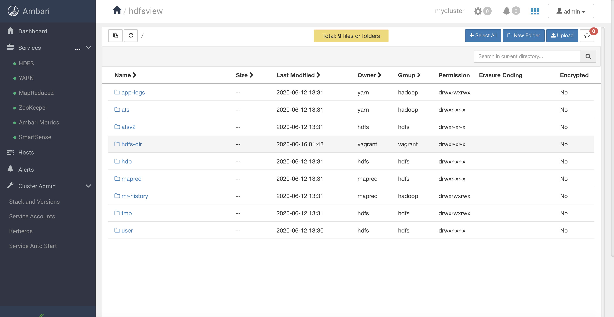
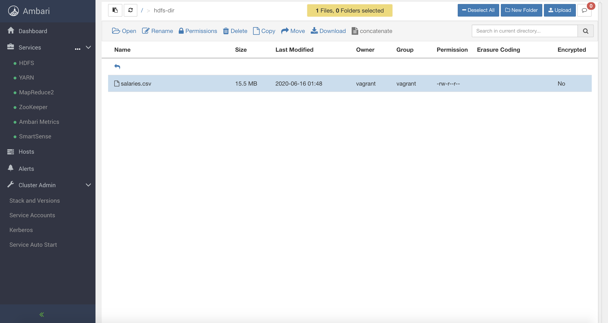
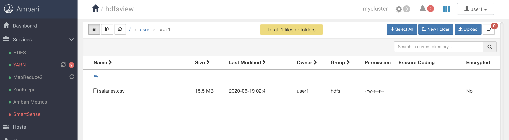
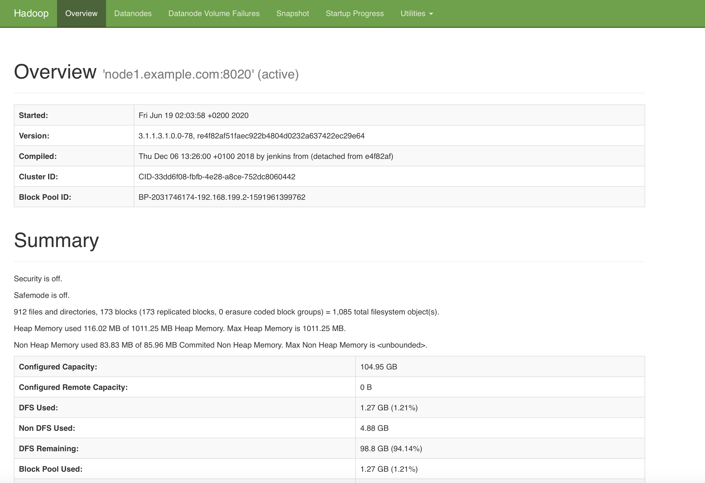
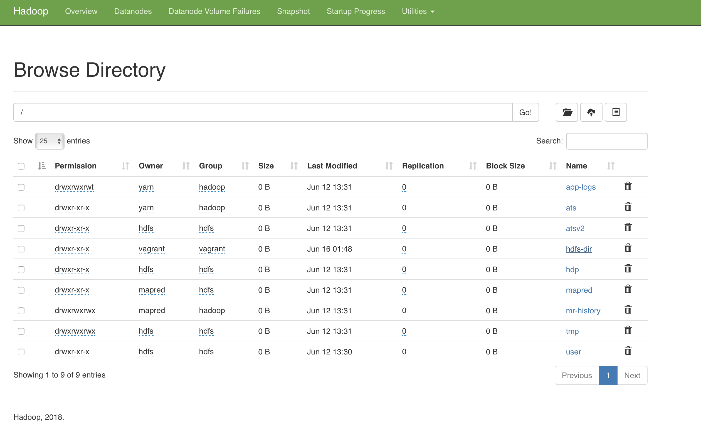
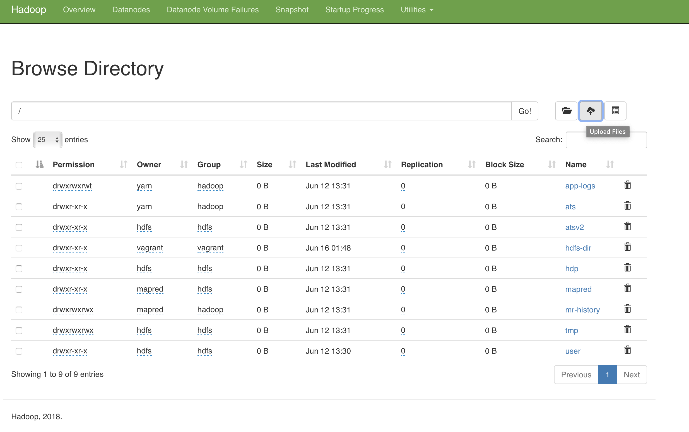

# HFDS file upload using browser

This lab references hosts, users, paths and other details that belong to the [Vagrant-provisioned 3 nodes Hadoop cluster](../01-Provision_the_environment/Vagrant/README.md).

The [Vagrant-provisioned 3 nodes Hadoop cluster](../01-Provision_the_environment/Vagrant/README.md) should have been started before executing this lab.

Also, all the cluster services must be started as show in the picture below:

## Upload a file to HDFS

Login into Ambari and click on admin -> Manage Ambari in the top right corner of the screen.

Now click on Views on the left

Create a new view instance of type files

After having created a new view, just open it

Within the files view you shoud see the node1's file system as show below

If you click on the **hdfs-dir** folder (created in the previous lab), you enter in it and you can find the **salaries.csv** file uploaded using the HDFS cli.

Here you can create news directories, open files, upload new files, download them and see all the file's metadata.

If you want to see some HDFS statistics, you can click [here](http://192.168.199.2:50070) to enter into the Hadoop dashboard.

If you click on the **Utilities** menu, you can browse the file system as well

Here you can upload files as with the Ambari web application.

