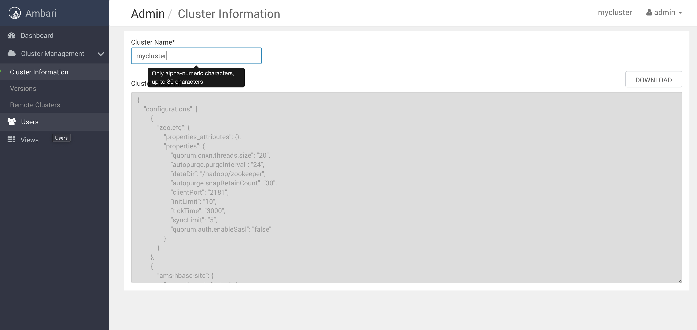
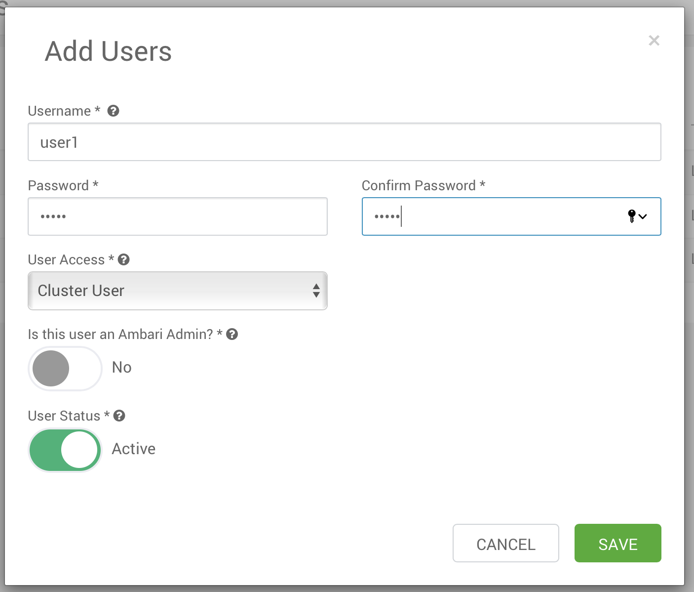
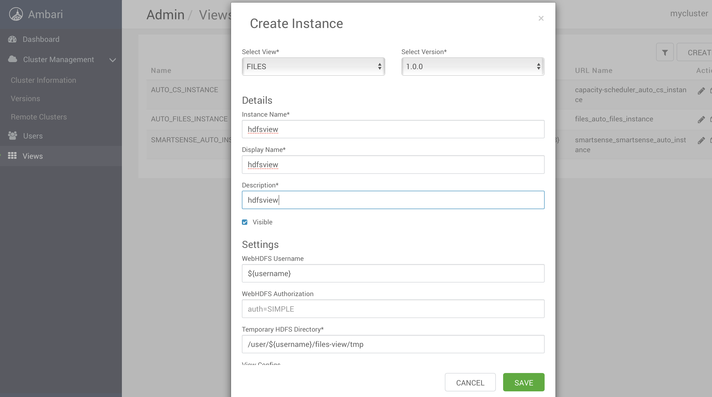
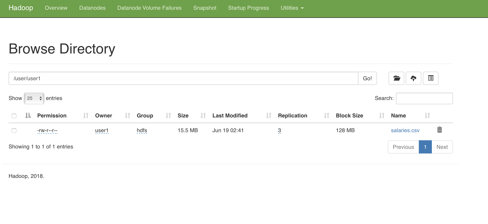

# HFDS file upload using browser

This lab references hosts, users, paths and other details that belong to the [Vagrant-provisioned 3 nodes Hadoop cluster](../02-Provision_the_environment/Vagrant/README.md).

The [Vagrant-provisioned 3 nodes Hadoop cluster](../02-Provision_the_environment/Vagrant/README.md) should have been started before executing this lab.

Also, all the cluster services must be started as show in the picture below:

## Create a new user

Login into Ambari as the user **admin** and click on admin -> Manage Ambari in the top right corner of the screen.

Now click on Users on the left

Click on ADD USER and create a new user named user1 (set the same password as the user for your convenience):

The **user1** should have been created correctly.

## Upload a file to HDFS

Login into Ambari as the user **admin** and click on admin -> Manage Ambari in the top right corner of the screen.

Now click on Views on the left

Create a new view instance of type files

Now logout from Ambari and login again with the user **user1** (password **user1**)

Open the view you have just created

Within the files view you shoud see the node1's file system as show below

Click on the **user** folder and you enter in it. Now click on **user1** home directory.

Here you can create news directories, open files, upload new files, download them and see all the file's metadata.

Click on **Upload** and upload the same **salaries.csv** file we used in the previous lab (you find it in the /datasets folder of this repo).

The file should have been uploaded into the **/user/user1** folder

If you want to see some HDFS statistics, you can click [here](http://192.168.199.2:50070) to enter into the Hadoop dashboard.

If you click on the **Utilities** menu, you can browse the file system as well.

If you go into the **/user/user1** folder, you can see the same file you uploaded earlier.

If you click on **salaries.csv** you get informations about the file and how it has been divided into blocks (1 block only in this case since the file's dimensions are only 16Mb). For each block, you can see on which node the block has been replicated .

