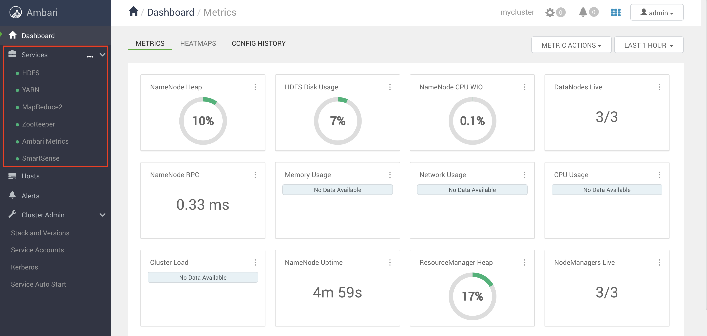

# Code MapReduce job

## Purpose 

Given the data regarding the electrical consumption of an organization, we have to write applications to process it and produce results such as finding the year of maximum usage, year of minimum usage, and so on. This is a walkover for the programmers with finite number of records. 
They will simply write the logic to produce the required output, and pass the data to the application written.
But, think of the data representing the electrical consumption of all the largescale industries of a particular state, since its formation.
When we write applications to process such bulk data:
                                                                      
- They will take a lot of time to execute.                                                                      
- There will be a heavy network traffic when we move data from source to network server and so on.
                                                                      
To solve these problems, we have the MapReduce framework.

## Prerequisites

- JDK 1.8 
- IntelliJ Idea Community Edition (or any other Java IDE)
- Maven

## Test locally

Clean and compile the application

```console
$ mvn clean && mvn compile
...
```
Run a local test

```console
$ mvn exec:java
[INFO] Scanning for projects...
[INFO] 
[INFO] --------------< it.sunnyvale.hadoop.labs:code-mapreduce >---------------
[INFO] Building code-mapreduce 1.0-SNAPSHOT
[INFO] --------------------------------[ jar ]---------------------------------
[INFO] 
[INFO] --- exec-maven-plugin:3.0.0:java (default-cli) @ code-mapreduce ---
WARNING: An illegal reflective access operation has occurred
WARNING: Illegal reflective access by org.apache.hadoop.security.authentication.util.KerberosUtil (file:/Users/denismaggiorotto/.m2/repository/org/apache/hadoop/hadoop-core/1.2.1/hadoop-core-1.2.1.jar) to method sun.security.krb5.Config.getInstance()
WARNING: Please consider reporting this to the maintainers of org.apache.hadoop.security.authentication.util.KerberosUtil
WARNING: Use --illegal-access=warn to enable warnings of further illegal reflective access operations
WARNING: All illegal access operations will be denied in a future release
20/07/11 19:12:48 WARN util.NativeCodeLoader: Unable to load native-hadoop library for your platform... using builtin-java classes where applicable
20/07/11 19:12:48 WARN mapred.JobClient: Use GenericOptionsParser for parsing the arguments. Applications should implement Tool for the same.
20/07/11 19:12:48 WARN mapred.JobClient: No job jar file set.  User classes may not be found. See JobConf(Class) or JobConf#setJar(String).
20/07/11 19:12:48 WARN snappy.LoadSnappy: Snappy native library not loaded
20/07/11 19:12:48 INFO mapred.FileInputFormat: Total input paths to process : 1
20/07/11 19:12:48 INFO mapred.JobClient: Running job: job_local662185113_0001
20/07/11 19:12:48 INFO mapred.LocalJobRunner: Waiting for map tasks
20/07/11 19:12:48 INFO mapred.LocalJobRunner: Starting task: attempt_local662185113_0001_m_000000_0
20/07/11 19:12:48 INFO mapred.Task:  Using ResourceCalculatorPlugin : null
20/07/11 19:12:48 INFO mapred.MapTask: Processing split: file:/Users/denismaggiorotto/Documents/SoxelyNCFS/Sunnyvale/Clienti/ITS-ICT/2019-2021/Cloud/BigData/repos/ITS-ICT_BigData/labs/06-Code_MapReduce_job/input/sample.txt:0+218
20/07/11 19:12:48 INFO mapred.MapTask: numReduceTasks: 1
20/07/11 19:12:48 INFO mapred.MapTask: io.sort.mb = 100
20/07/11 19:12:48 INFO mapred.MapTask: data buffer = 79691776/99614720
20/07/11 19:12:48 INFO mapred.MapTask: record buffer = 262144/327680
20/07/11 19:12:48 INFO mapred.MapTask: Starting flush of map output
20/07/11 19:12:48 INFO mapred.MapTask: Finished spill 0
20/07/11 19:12:48 INFO mapred.Task: Task:attempt_local662185113_0001_m_000000_0 is done. And is in the process of commiting
20/07/11 19:12:48 INFO mapred.LocalJobRunner: file:/Users/denismaggiorotto/Documents/SoxelyNCFS/Sunnyvale/Clienti/ITS-ICT/2019-2021/Cloud/BigData/repos/ITS-ICT_BigData/labs/06-Code_MapReduce_job/input/sample.txt:0+218
20/07/11 19:12:48 INFO mapred.Task: Task 'attempt_local662185113_0001_m_000000_0' done.
20/07/11 19:12:48 INFO mapred.LocalJobRunner: Finishing task: attempt_local662185113_0001_m_000000_0
20/07/11 19:12:48 INFO mapred.LocalJobRunner: Map task executor complete.
20/07/11 19:12:48 INFO mapred.Task:  Using ResourceCalculatorPlugin : null
20/07/11 19:12:48 INFO mapred.LocalJobRunner: 
20/07/11 19:12:48 INFO mapred.Merger: Merging 1 sorted segments
20/07/11 19:12:48 INFO mapred.Merger: Down to the last merge-pass, with 1 segments left of total size: 35 bytes
20/07/11 19:12:48 INFO mapred.LocalJobRunner: 
20/07/11 19:12:48 INFO mapred.Task: Task:attempt_local662185113_0001_r_000000_0 is done. And is in the process of commiting
20/07/11 19:12:48 INFO mapred.LocalJobRunner: 
20/07/11 19:12:48 INFO mapred.Task: Task attempt_local662185113_0001_r_000000_0 is allowed to commit now
20/07/11 19:12:48 INFO mapred.FileOutputCommitter: Saved output of task 'attempt_local662185113_0001_r_000000_0' to file:/Users/denismaggiorotto/Documents/SoxelyNCFS/Sunnyvale/Clienti/ITS-ICT/2019-2021/Cloud/BigData/repos/ITS-ICT_BigData/labs/06-Code_MapReduce_job/output
20/07/11 19:12:48 INFO mapred.LocalJobRunner: reduce > reduce
20/07/11 19:12:48 INFO mapred.Task: Task 'attempt_local662185113_0001_r_000000_0' done.
20/07/11 19:12:49 INFO mapred.JobClient:  map 100% reduce 100%
20/07/11 19:12:49 INFO mapred.JobClient: Job complete: job_local662185113_0001
20/07/11 19:12:49 INFO mapred.JobClient: Counters: 18
20/07/11 19:12:49 INFO mapred.JobClient:   Map-Reduce Framework
20/07/11 19:12:49 INFO mapred.JobClient:     Spilled Records=6
20/07/11 19:12:49 INFO mapred.JobClient:     Map output materialized bytes=39
20/07/11 19:12:49 INFO mapred.JobClient:     Reduce input records=3
20/07/11 19:12:49 INFO mapred.JobClient:     Map input records=5
20/07/11 19:12:49 INFO mapred.JobClient:     SPLIT_RAW_BYTES=218
20/07/11 19:12:49 INFO mapred.JobClient:     Map output bytes=45
20/07/11 19:12:49 INFO mapred.JobClient:     Reduce shuffle bytes=0
20/07/11 19:12:49 INFO mapred.JobClient:     Map input bytes=218
20/07/11 19:12:49 INFO mapred.JobClient:     Reduce input groups=3
20/07/11 19:12:49 INFO mapred.JobClient:     Combine output records=3
20/07/11 19:12:49 INFO mapred.JobClient:     Reduce output records=3
20/07/11 19:12:49 INFO mapred.JobClient:     Map output records=5
20/07/11 19:12:49 INFO mapred.JobClient:     Combine input records=5
20/07/11 19:12:49 INFO mapred.JobClient:     Total committed heap usage (bytes)=406847488
20/07/11 19:12:49 INFO mapred.JobClient:   File Input Format Counters 
20/07/11 19:12:49 INFO mapred.JobClient:     Bytes Read=218
20/07/11 19:12:49 INFO mapred.JobClient:   FileSystemCounters
20/07/11 19:12:49 INFO mapred.JobClient:     FILE_BYTES_WRITTEN=104182
20/07/11 19:12:49 INFO mapred.JobClient:     FILE_BYTES_READ=1021
20/07/11 19:12:49 INFO mapred.JobClient:   File Output Format Counters 
20/07/11 19:12:49 INFO mapred.JobClient:     Bytes Written=36
[INFO] ------------------------------------------------------------------------
[INFO] BUILD SUCCESS
[INFO] ------------------------------------------------------------------------
[INFO] Total time:  3.457 s
[INFO] Finished at: 2020-07-11T19:12:49+02:00
[INFO] ------------------------------------------------------------------------
```

Check the result

```console
$ cat output/part-00000 
  1981    34
  1984    40
  1985    45

```

## Submit to Hadoop cluster

Submit the job to a Hadoop cluster

Create the JAR file

```console
$ mvn package
[INFO] Scanning for projects...
[INFO] 
[INFO] --------------< it.sunnyvale.hadoop.labs:code-mapreduce >---------------
[INFO] Building code-mapreduce 1.0-SNAPSHOT
[INFO] --------------------------------[ jar ]---------------------------------
[INFO] 
[INFO] --- maven-resources-plugin:2.6:resources (default-resources) @ code-mapreduce ---
[WARNING] Using platform encoding (UTF-8 actually) to copy filtered resources, i.e. build is platform dependent!
[INFO] Copying 0 resource
[INFO] 
[INFO] --- maven-compiler-plugin:3.1:compile (default-compile) @ code-mapreduce ---
[INFO] Nothing to compile - all classes are up to date
[INFO] 
[INFO] --- maven-resources-plugin:2.6:testResources (default-testResources) @ code-mapreduce ---
[WARNING] Using platform encoding (UTF-8 actually) to copy filtered resources, i.e. build is platform dependent!
[INFO] skip non existing resourceDirectory /Users/denismaggiorotto/Documents/SoxelyNCFS/Sunnyvale/Clienti/ITS-ICT/2019-2021/Cloud/BigData/repos/ITS-ICT_BigData/labs/06-Code_MapReduce_job/src/test/resources
[INFO] 
[INFO] --- maven-compiler-plugin:3.1:testCompile (default-testCompile) @ code-mapreduce ---
[INFO] Nothing to compile - all classes are up to date
[INFO] 
[INFO] --- maven-surefire-plugin:2.12.4:test (default-test) @ code-mapreduce ---
[INFO] No tests to run.
[INFO] 
[INFO] --- maven-jar-plugin:2.4:jar (default-jar) @ code-mapreduce ---
[INFO] ------------------------------------------------------------------------
[INFO] BUILD SUCCESS
[INFO] ------------------------------------------------------------------------
[INFO] Total time:  2.797 s
[INFO] Finished at: 2020-07-11T19:17:16+02:00
[INFO] ------------------------------------------------------------------------
```

If not already up and running, start the lab environment

```console
$ cd ../02-Provision_the_environment/Vagrant  
$ vagrant up
```

Services must be running as well, please refer to the image below:



Log into the **node1** machine

```console
$ vagrant ssh node1
```

Create the input folder on HDFS:

```console
[vagrant@node1 ~]$ hadoop fs -mkdir lab6_input
```

Load the dataset file into the HDFS input folder:

```console
[vagrant@node1 ~]$ hadoop fs -put /home/vagrant/ITS-ICT_BigData/labs/06-Code_MapReduce_job/input/sample.txt lab6_input
```

Verify that the file has been loaded to HDFS

```console
$ 
[vagrant@node1 ~]$ hadoop fs -ls lab6_input
Found 1 items
-rw-r--r--   3 vagrant hdfs        218 2020-07-13 10:32 lab6_input/sample.txt
```

Submit the MapReduce job using YARN

```console
[vagrant@node1 ~]$ yarn jar /home/vagrant/ITS-ICT_BigData/labs/06-Code_MapReduce_job/target/code-mapreduce-1.0-SNAPSHOT.jar it.sunnyvale.hadoop.labs.CodeMapReduce lab6_input lab6_output 
20/07/13 10:36:08 INFO client.RMProxy: Connecting to ResourceManager at node1.example.com/192.168.199.2:8050
20/07/13 10:36:08 INFO client.AHSProxy: Connecting to Application History server at node2.example.com/192.168.199.3:10200
20/07/13 10:36:08 INFO client.RMProxy: Connecting to ResourceManager at node1.example.com/192.168.199.2:8050
20/07/13 10:36:08 INFO client.AHSProxy: Connecting to Application History server at node2.example.com/192.168.199.3:10200
20/07/13 10:36:09 WARN mapreduce.JobResourceUploader: Hadoop command-line option parsing not performed. Implement the Tool interface and execute your application with ToolRunner to remedy this.
20/07/13 10:36:09 INFO mapreduce.JobResourceUploader: Disabling Erasure Coding for path: /user/vagrant/.staging/job_1594635771181_0001
20/07/13 10:36:10 INFO mapred.FileInputFormat: Total input files to process : 1
20/07/13 10:36:10 INFO mapreduce.JobSubmitter: number of splits:2
20/07/13 10:36:11 INFO mapreduce.JobSubmitter: Submitting tokens for job: job_1594635771181_0001
20/07/13 10:36:11 INFO mapreduce.JobSubmitter: Executing with tokens: []
20/07/13 10:36:12 INFO conf.Configuration: found resource resource-types.xml at file:/etc/hadoop/3.1.0.0-78/0/resource-types.xml
20/07/13 10:36:12 INFO impl.YarnClientImpl: Submitted application application_1594635771181_0001
20/07/13 10:36:13 INFO mapreduce.Job: The url to track the job: http://node1.example.com:8088/proxy/application_1594635771181_0001/
20/07/13 10:36:13 INFO mapreduce.Job: Running job: job_1594635771181_0001
20/07/13 10:36:33 INFO mapreduce.Job: Job job_1594635771181_0001 running in uber mode : false
20/07/13 10:36:33 INFO mapreduce.Job:  map 0% reduce 0%
20/07/13 10:36:54 INFO mapreduce.Job:  map 50% reduce 0%
20/07/13 10:36:57 INFO mapreduce.Job:  map 100% reduce 0%
20/07/13 10:37:03 INFO mapreduce.Job:  map 100% reduce 100%
20/07/13 10:37:04 INFO mapreduce.Job: Job job_1594635771181_0001 completed successfully
20/07/13 10:37:04 INFO mapreduce.Job: Counters: 53
        File System Counters
                FILE: Number of bytes read=39
                FILE: Number of bytes written=696926
                FILE: Number of read operations=0
                FILE: Number of large read operations=0
                FILE: Number of write operations=0
                HDFS: Number of bytes read=559
                HDFS: Number of bytes written=24
                HDFS: Number of read operations=11
                HDFS: Number of large read operations=0
                HDFS: Number of write operations=2
        Job Counters 
                Launched map tasks=2
                Launched reduce tasks=1
                Data-local map tasks=2
                Total time spent by all maps in occupied slots (ms)=35409
                Total time spent by all reduces in occupied slots (ms)=11170
                Total time spent by all map tasks (ms)=35409
                Total time spent by all reduce tasks (ms)=5585
                Total vcore-milliseconds taken by all map tasks=35409
                Total vcore-milliseconds taken by all reduce tasks=5585
                Total megabyte-milliseconds taken by all map tasks=9064704
                Total megabyte-milliseconds taken by all reduce tasks=2848350
        Map-Reduce Framework
                Map input records=5
                Map output records=5
                Map output bytes=45
                Map output materialized bytes=45
                Input split bytes=232
                Combine input records=5
                Combine output records=3
                Reduce input groups=3
                Reduce shuffle bytes=45
                Reduce input records=3
                Reduce output records=3
                Spilled Records=6
                Shuffled Maps =2
                Failed Shuffles=0
                Merged Map outputs=2
                GC time elapsed (ms)=540
                CPU time spent (ms)=3580
                Physical memory (bytes) snapshot=536453120
                Virtual memory (bytes) snapshot=6332391424
                Total committed heap usage (bytes)=291504128
                Peak Map Physical memory (bytes)=200171520
                Peak Map Virtual memory (bytes)=2051686400
                Peak Reduce Physical memory (bytes)=139005952
                Peak Reduce Virtual memory (bytes)=2229211136
        Shuffle Errors
                BAD_ID=0
                CONNECTION=0
                IO_ERROR=0
                WRONG_LENGTH=0
                WRONG_MAP=0
                WRONG_REDUCE=0
        File Input Format Counters 
                Bytes Read=327
        File Output Format Counters 
                Bytes Written=24
```

Verify the output

```console
[vagrant@node1 ~]$ hadoop fs -ls lab6_output
Found 2 items
-rw-r--r--   3 vagrant hdfs          0 2020-07-13 10:37 lab6_output/_SUCCESS
-rw-r--r--   3 vagrant hdfs         24 2020-07-13 10:37 lab6_output/part-00000
```

Display the output file:

```console
[vagrant@node1 ~]$ hadoop fs -cat lab6_output/part-00000
1981    34
1984    40
1985    45
```

