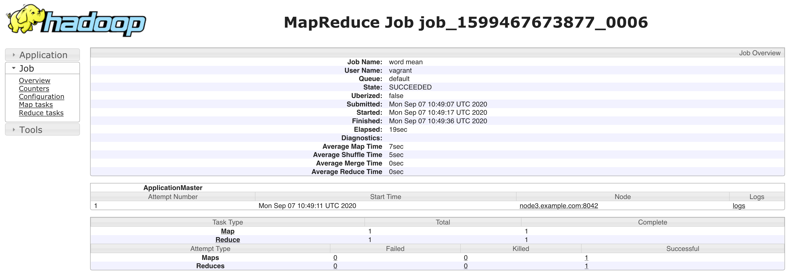
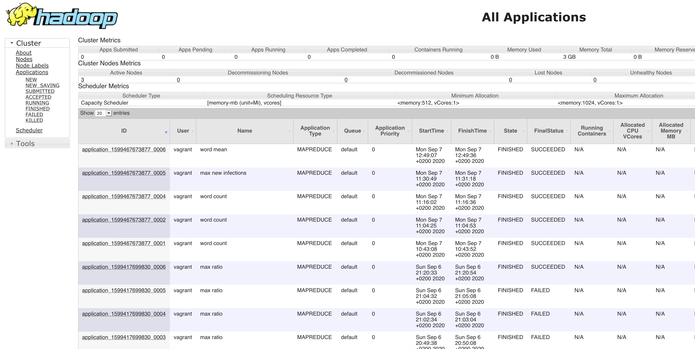
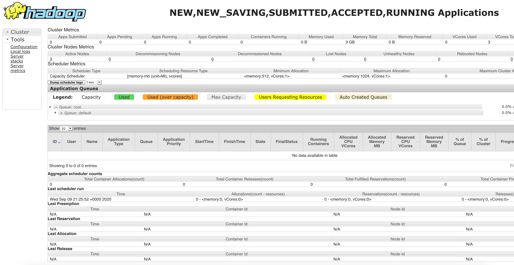
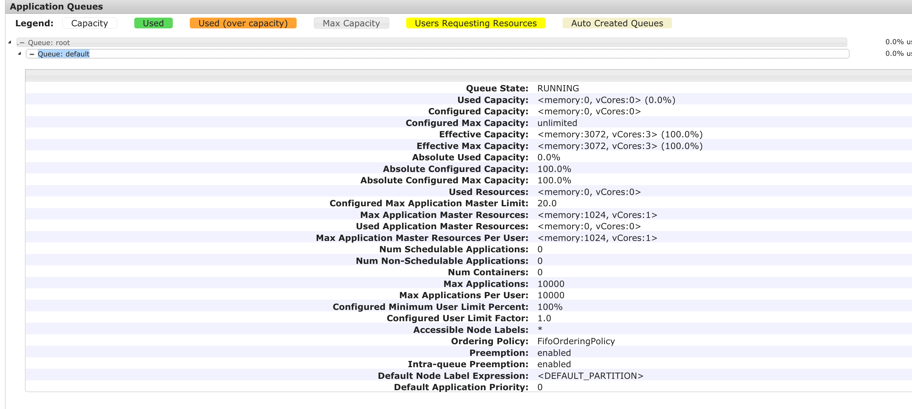
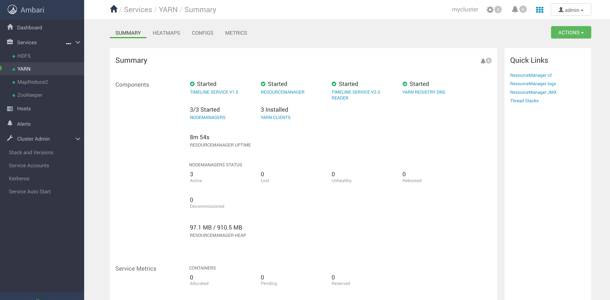
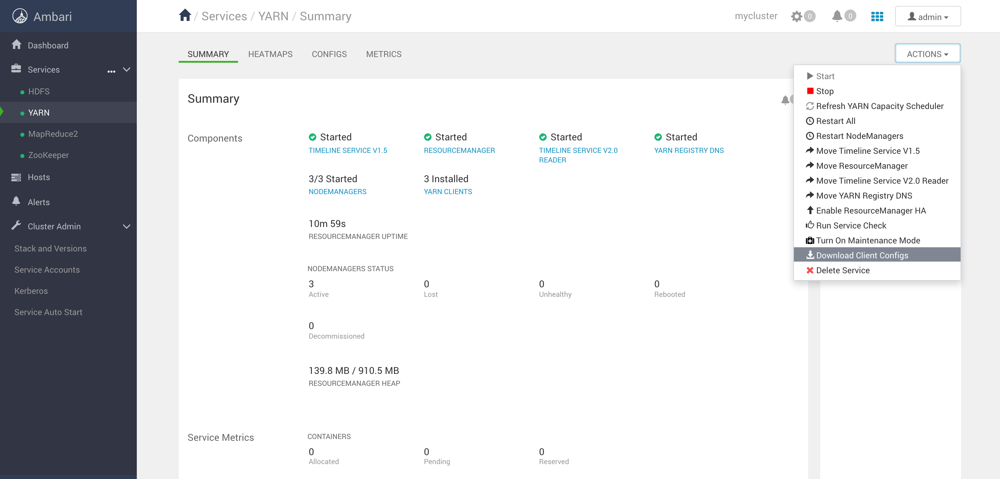

# Yarn

## Prerequisites

This lab references hosts, users, paths and other details that belong to the [Vagrant-provisioned 3 nodes Hadoop cluster](../02-Provision_the_environment/Vagrant/README.md).

The [Vagrant-provisioned 3 nodes Hadoop cluster](../02-Provision_the_environment/Vagrant/README.md) should have been started before executing this lab.

Also, all the cluster services must be started as show in the picture below:  


It is possible to run this lab in any other environment (i.e.: Hortonworks Sandbox or Cloudera DataFlow) provided some small changes to the elements listed above.

Lab [03 - HFDS_file_upload_using_CLI](../03-03-HFDS_file_upload_using_CLI/README.md) must be completed BEFORE this one.

If you are using the Vagrant-based lab environment, you have to append the following three lines into **/etc/hosts** (*nix) into **C:/Windows/System32/driver/etc/hosts** (Windows).

```
192.168.199.2 node1.example.com
192.168.199.3 node2.example.com
192.168.199.4 node3.example.com
```

If you are using any other lab environment (Cloudera, Hortonworks VM/s), just make sure that your host resolves the VM/s by name.


# Run the lab

This lab is using the following Hadoop example application:

  **wordmean: A map/reduce program that counts the average length of the words in the input files.**

### Upload the input dataset to HDFS

Go to path **ITS-ICT_BigData/labs/02-Provision_the_environment/Vagrant** and connect to node 1.

```console
$ vagrant ssh node1 
[vagrant@node1 ~]$ 
```

Now, load on HDFS the file **constitution.txt** from the dataset folder of this repo

```console
[vagrant@node1 ~]$ hadoop fs -put /home/vagrant/ITS-ICT_BigData/datasets/constitution.txt /hdfs-dir/constitution.txt
[vagrant@node1 ~]$
```

To verify the file upload, just type:

```console
[vagrant@node1 ~]$ hadoop fs -ls /hdfs-dir
Found 2 items
-rw-r--r--   3 vagrant vagrant      44840 2020-06-23 23:22 /hdfs-dir/constitution.txt
```


```console
[vagrant@node1 ~]$ yarn jar /usr/hdp/current/hadoop-mapreduce-client/hadoop-mapreduce-examples.jar wordmean /hdfs-dir lab8_output
20/09/07 10:49:05 INFO client.RMProxy: Connecting to ResourceManager at node1.example.com/192.168.199.2:8050
20/09/07 10:49:05 INFO client.AHSProxy: Connecting to Application History server at node2.example.com/192.168.199.3:10200
20/09/07 10:49:06 INFO mapreduce.JobResourceUploader: Disabling Erasure Coding for path: /user/vagrant/.staging/job_1599467673877_0006
20/09/07 10:49:06 INFO input.FileInputFormat: Total input files to process : 1
20/09/07 10:49:06 INFO mapreduce.JobSubmitter: number of splits:1
20/09/07 10:49:07 INFO mapreduce.JobSubmitter: Submitting tokens for job: job_1599467673877_0006
20/09/07 10:49:07 INFO mapreduce.JobSubmitter: Executing with tokens: []
20/09/07 10:49:07 INFO conf.Configuration: found resource resource-types.xml at file:/etc/hadoop/3.1.0.0-78/0/resource-types.xml
20/09/07 10:49:07 INFO impl.YarnClientImpl: Submitted application application_1599467673877_0006
20/09/07 10:49:08 INFO mapreduce.Job: The url to track the job: http://node1.example.com:8088/proxy/application_1599467673877_0006/
20/09/07 10:49:08 INFO mapreduce.Job: Running job: job_1599467673877_0006
20/09/07 10:49:19 INFO mapreduce.Job: Job job_1599467673877_0006 running in uber mode : false
20/09/07 10:49:19 INFO mapreduce.Job:  map 0% reduce 0%
20/09/07 10:49:29 INFO mapreduce.Job:  map 100% reduce 0%
20/09/07 10:49:37 INFO mapreduce.Job:  map 100% reduce 100%
20/09/07 10:49:38 INFO mapreduce.Job: Job job_1599467673877_0006 completed successfully
20/09/07 10:49:39 INFO mapreduce.Job: Counters: 53
        File System Counters
                FILE: Number of bytes read=39
                FILE: Number of bytes written=464981
                FILE: Number of read operations=0
                FILE: Number of large read operations=0
                FILE: Number of write operations=0
                HDFS: Number of bytes read=44960
                HDFS: Number of bytes written=24
                HDFS: Number of read operations=8
                HDFS: Number of large read operations=0
                HDFS: Number of write operations=2
        Job Counters 
                Launched map tasks=1
                Launched reduce tasks=1
                Data-local map tasks=1
                Total time spent by all maps in occupied slots (ms)=7263
                Total time spent by all reduces in occupied slots (ms)=11162
                Total time spent by all map tasks (ms)=7263
                Total time spent by all reduce tasks (ms)=5581
                Total vcore-milliseconds taken by all map tasks=7263
                Total vcore-milliseconds taken by all reduce tasks=5581
                Total megabyte-milliseconds taken by all map tasks=3718656
                Total megabyte-milliseconds taken by all reduce tasks=5714944
        Map-Reduce Framework
                Map input records=865
                Map output records=15240
                Map output bytes=220980
                Map output materialized bytes=39
                Input split bytes=120
                Combine input records=15240
                Combine output records=2
                Reduce input groups=2
                Reduce shuffle bytes=39
                Reduce input records=2
                Reduce output records=2
                Spilled Records=4
                Shuffled Maps =1
                Failed Shuffles=0
                Merged Map outputs=1
                GC time elapsed (ms)=359
                CPU time spent (ms)=2190
                Physical memory (bytes) snapshot=369373184
                Virtual memory (bytes) snapshot=5169356800
                Total committed heap usage (bytes)=185597952
                Peak Map Physical memory (bytes)=190210048
                Peak Map Virtual memory (bytes)=2344255488
                Peak Reduce Physical memory (bytes)=179163136
                Peak Reduce Virtual memory (bytes)=2825101312
        Shuffle Errors
                BAD_ID=0
                CONNECTION=0
                IO_ERROR=0
                WRONG_LENGTH=0
                WRONG_MAP=0
                WRONG_REDUCE=0
        File Input Format Counters 
                Bytes Read=44840
        File Output Format Counters 
                Bytes Written=24
The mean is: 4.8627296587926505
```


```console
[vagrant@node1]$ hadoop fs -ls lab8_output
Found 2 items
-rw-r--r--   3 vagrant hdfs          0 2020-09-07 10:49 lab8_output/_SUCCESS
-rw-r--r--   3 vagrant hdfs         24 2020-09-07 10:49 lab8_output/part-r-00000
```

```console
[vagrant@node1]$ hadoop fs -cat lab8_output/part-r-00000
count   7620
length  37054
```

Have a look of the following line
```
20/09/07 10:49:05 INFO client.RMProxy: Connecting to ResourceManager at node1.example.com/192.168.199.2:8050
```

The yarn client is contacting the  ResourceManager so submit the yob (node1.example.com/192.168.199.2:8050)

After the application has been submitted, you get a URL to track the job

```
20/09/07 10:49:08 INFO mapreduce.Job: The url to track the job: http://node1.example.com:8088/proxy/application_1599467673877_0006/
```

If you put the link that Hadoop showed in your environment in a browser, you will see:



You can see here only one attempt to run the job, the Application Master has been run on node 3 and you can also inspect the logs.

In the table below you can see that only 1 map task and 1 reduce task have been executed and completed successfully.

Move around following the links on the page to discover more information about your run.

If you point your brower to http://node1.example.com:8088/cluster (Vagrant-based environment only) you will see:



This page shows some overall cluster informations. In the table you can find all the job submissions with the user, the application type, the state and the final state for each one.

In the Cluster Metrics table note the VCores total and Memory total.

In the Scheduler Metrics table you can see the minimum and the maximum resources that can be allocated per container.

Clicking on Scheduler on the left you get some informations about the Scheduler process.



In the center of the sceen you can see some statistics of the default queue (expand the **Queue: default** accordion)



A queue is a resource bucket you can get resources from. The default queue has all the cluster cupacity but you can create other queues and even subqueues.

More about the Capacity Scheduler [here](https://hadoop.apache.org/docs/current/hadoop-yarn/hadoop-yarn-site/CapacityScheduler.html)

Yarn can be fully managed and monitored using Ambari



If you want to submit jobs from a client external to the cluster (until now we only submitted jobs from node1), you can download the **client configurations**



