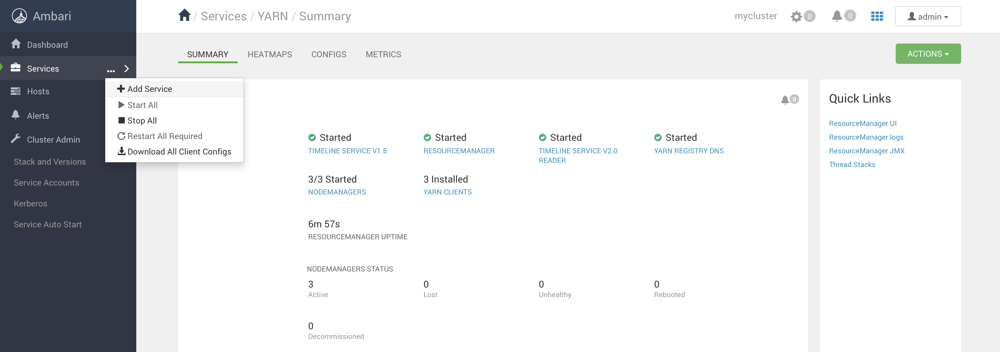
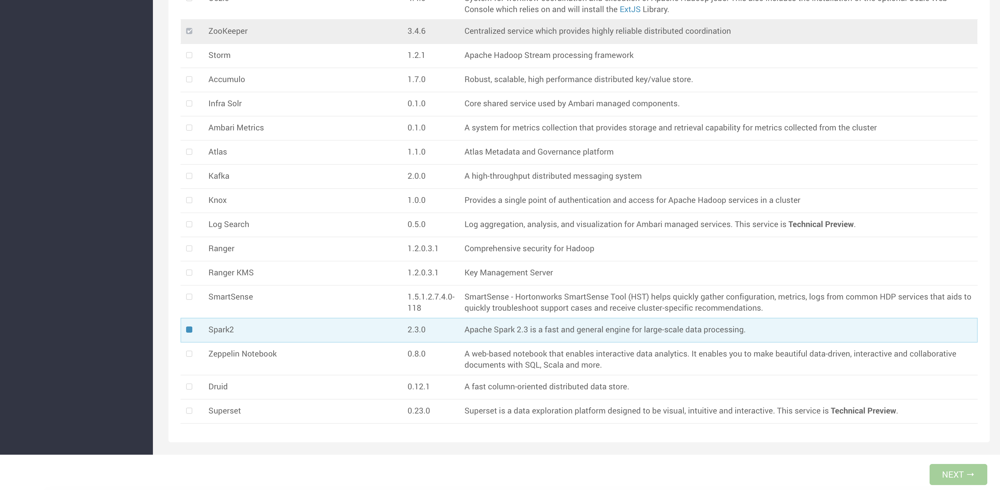
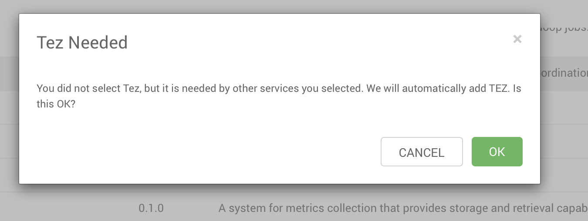
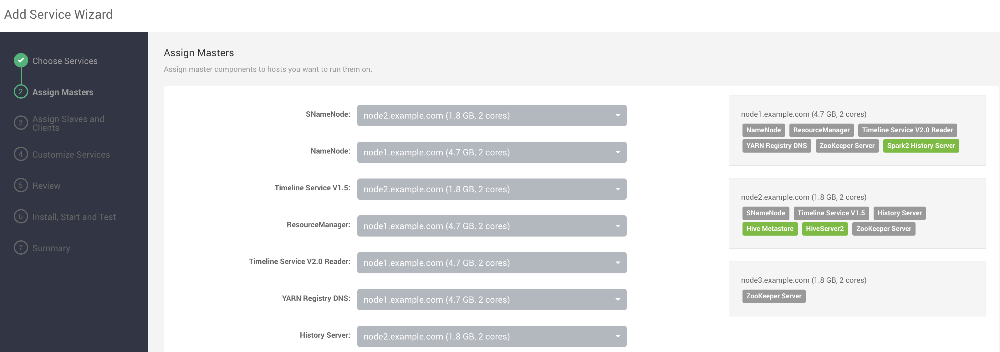
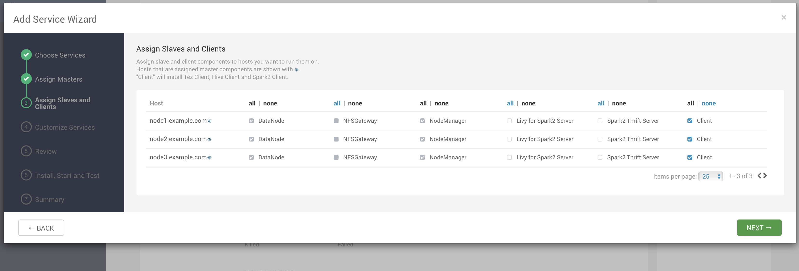
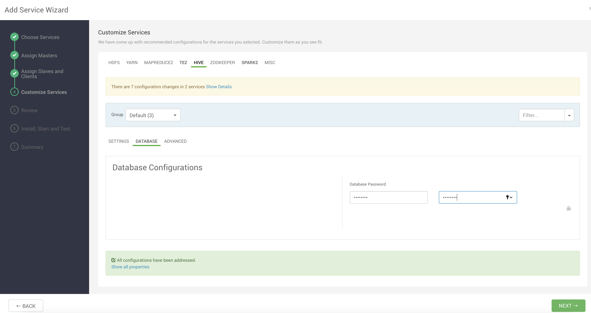
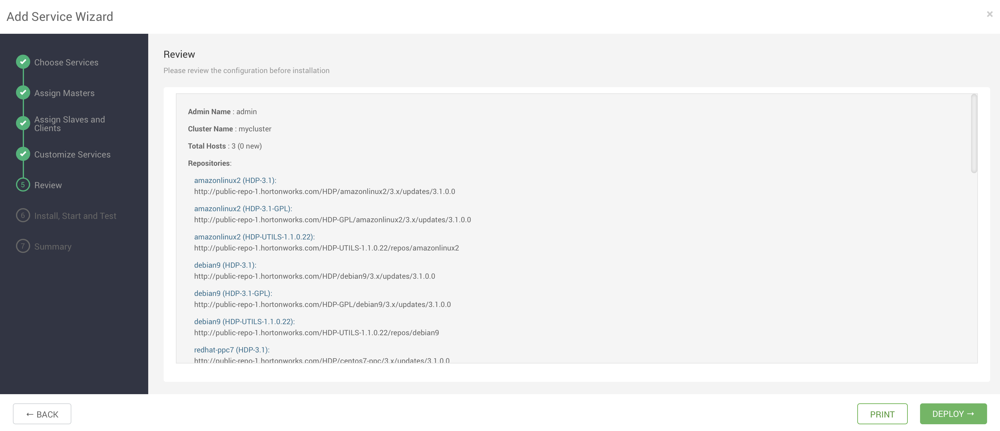
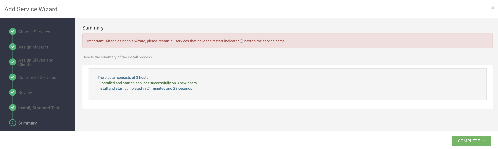
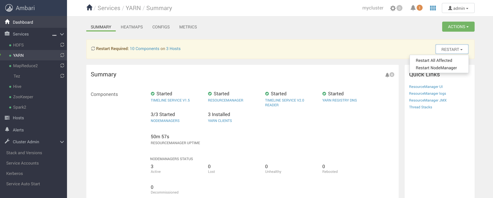

# Spark installation

This lab is intended to guide you installing Spark on a previously set-up Ambari cluster

## Prerequisites

- Having completed the lab [02 - Provision the environment](../02-Provision_the_environment/README.md)
- MySQL JDBC driver must be setup on the node where Ambari server runs

If you have't installed MySQL JDBC driver on the Ambari server node, just jump on it and type:

```
$ sudo yum install mysql-connector-java -y
```

Then, let Ambari know about it 

```
$ sudo ambari-server setup --jdbc-db=mysql --jdbc-driver=/usr/share/java/mysql-connector-java.jar
```


## Install Spark

After having logged in into Ambari using the web UI, follow the visual instructions listed below:

Click on Add Service

Select Spark

Accept all the other components installation prompt


Distribute the new components on the cluster nodes (this image is just an example, you can spread them as you prefer)

Accept the default and click on NEXT

In order to proceed, type a password in the HIVE -> DATABASE section (not it down for later use)

Accept the proposal and click on PROCEED ANYWAY

Click on DEPLOY

After the installation, click on COMPLETE

Restart all the affected components as the warning message states


