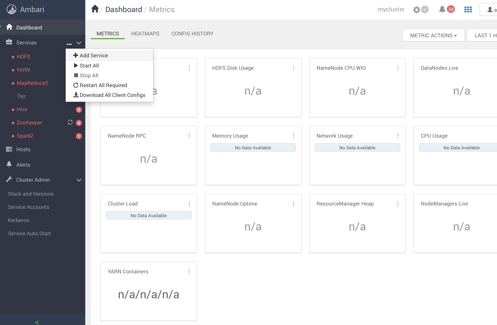
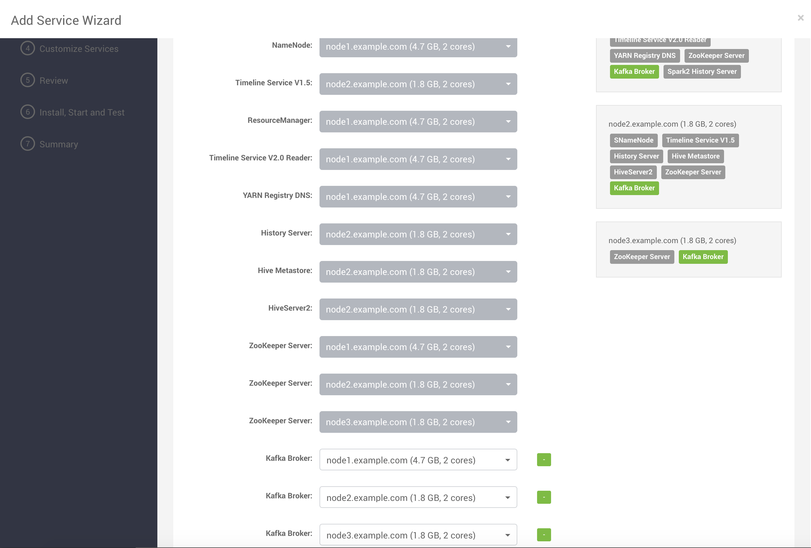
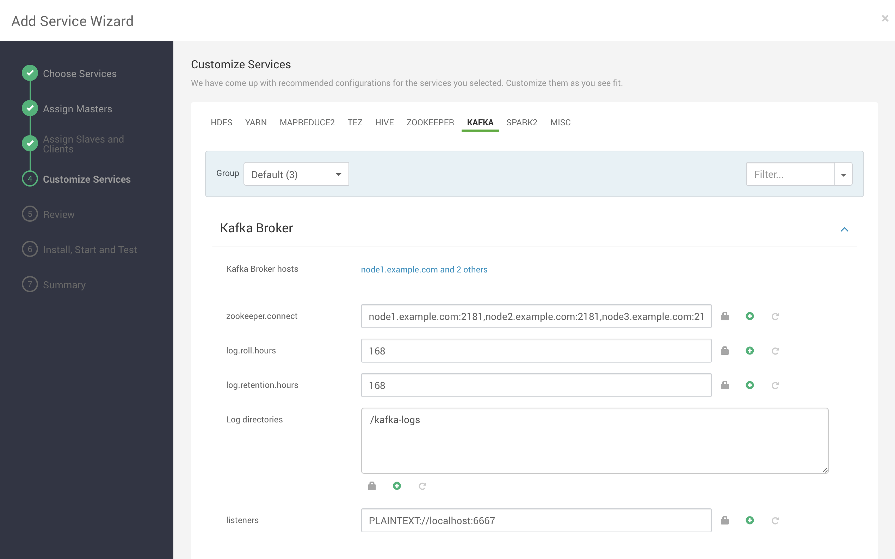
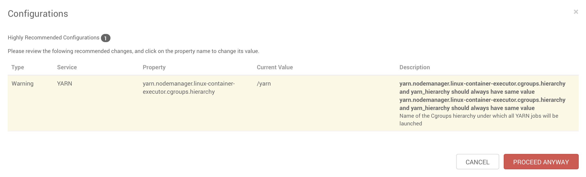
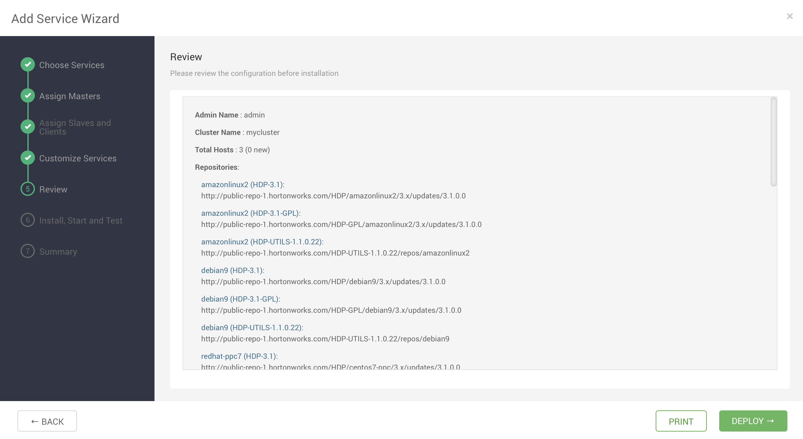
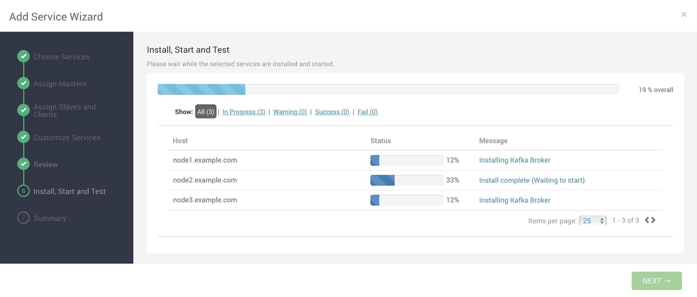
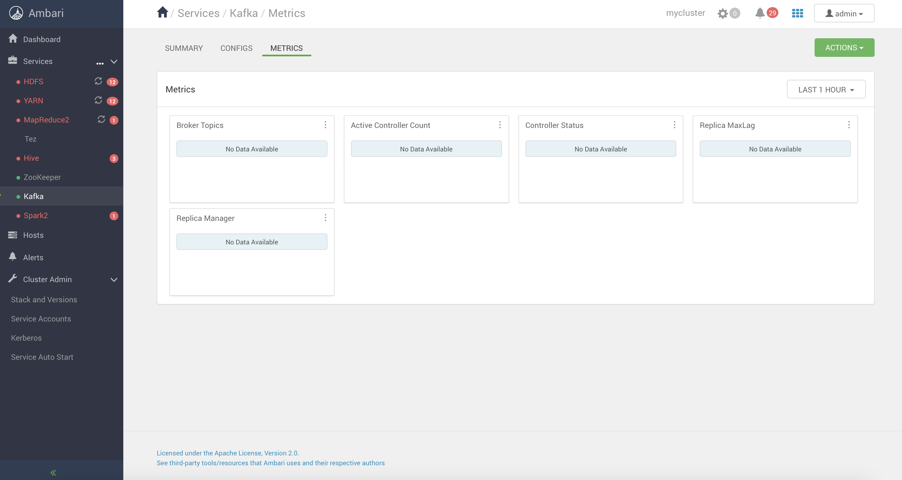

# Install Apache Kafka

## Prerequisites

- Having provisioned one of the following Ambari clusters:
    - Vagrant single node cluster [instructions here](../02-Provision_the_environment/Vagrant_single_node/README.md)
    - Vagrant 3 nodes cluster [instructions here](../02-Provision_the_environment/Vagrant/README.md)

Screenshots in this README are taken from a 3 nodes cluster, if you run the same wizard on a single node cluster the installation steps might change slightly.

## Install Kafka

Click on **Services -> Add Service**



Select **Kafka** from the list


If you are using the 3 nodes cluster, make sure to put a Kafka broker on each node and click  **NEXT**.

If you are using the single node cluster, just click **NEXT**



Accept the default values here



If you get any warnings, just click on **PROCEED ANYWAY**



Review your choices and click on **DEPLOY**



The installation procedure starts



When done, start both **Zookeeper** and **Kafka** exactly in this order so as they appear in green.



## Test the installation

### Check log files

If you have any trouble in keeping Kafka up and running, connect to the broker host/s and check Kafka log files.

In the following example, we inspect the Kafka process on node1. 

Connect to the node

```
$ cd ITS-ICT_BigData/labs/02-Provision_the_environment/Vagrant
$ vagrant ssh node1
```

Check the process

```console
[vagrant@node1 ~]$ ps aux | grep kafka
kafka    10657  1.2  6.2 3661548 305220 ?      Sl   11:17   0:16 /usr/lib/jvm/jre//bin/java -Xmx1G -Xms1G -server -XX:+UseG1GC -XX:MaxGCPauseMillis=20 -XX:InitiatingHeapOccupancyPercent=35 -XX:+ExplicitGCInvokesConcurrent -Djava.awt.headless=true -Xloggc:/var/log/kafka/kafkaServer-gc.log -verbose:gc -XX:+PrintGCDetails -XX:+PrintGCDateStamps -XX:+PrintGCTimeStamps -XX:+UseGCLogFileRotation -XX:NumberOfGCLogFiles=10 -XX:GCLogFileSize=100M -Dcom.sun.management.jmxremote -Dcom.sun.management.jmxremote.authenticate=false -Dcom.sun.management.jmxremote.ssl=false -Dkafka.logs.dir=/var/log/kafka -Dlog4j.configuration=file:/usr/hdp/3.1.0.0-78/kafka/bin/../config/log4j.properties -cp /usr/hdp/3.1.0.0-78/kafka/bin/../libs/activation-1.1.1.jar:/usr/hdp/3.1.0.0-78/kafka/bin/../libs/aopalliance-repackaged-2.5.0-b42.jar:/usr/hdp/3.1.0.0-78/kafka/bin/../libs/argparse4j-0.7.0.jar:/usr/hdp/3.1.0.0-78/kafka/bin/../libs/audience-annotations-0.5.0.jar:/usr/hdp/3.1.0.0-78/kafka/bin/../libs/caffeine-2.6.1.jar:/usr/hdp/3.1.0.0-78/kafka/bin/../libs/commons-lang3-3.5.jar:/usr/hdp/3.1.0.0-78/kafka/bin/../libs/connect-api-2.0.0.3.1.0.0-78.jar:/usr/hdp/3.1.0.0-78/kafka/bin/../libs/connect-basic-auth-extension-2.0.0.3.1.0.0-78.jar:/usr/hdp/3.1.0.0-78/kafka/bin/../libs/connect-file-2.0.0.3.1.0.0-78.jar:/usr/hdp/3.1.0.0-78/kafka/bin/../libs/connect-json-2.0.0.3.1.0.0-78.jar:/usr/hdp/3.1.0.0-78/kafka/bin/../libs/connect-runtime-2.0.0.3.1.0.0-78.jar:/usr/hdp/3.1.0.0-78/kafka/bin/../libs/connect-transforms-2.0.0.3.1.0.0-78.jar:/usr/hdp/3.1.0.0-78/kafka/bin/../libs/guava-20.0.jar:/usr/hdp/3.1.0.0-78/kafka/bin/../libs/hk2-api-2.5.0-b42.jar:/usr/hdp/3.1.0.0-78/kafka/bin/../libs/hk2-locator-2.5.0-b42.jar:/usr/hdp/3.1.0.0-78/kafka/bin/../libs/hk2-utils-2.5.0-b42.jar:/usr/hdp/3.1.0.0-78/kafka/bin/../libs/jackson-annotations-2.9.6.jar:/usr/hdp/3.1.0.0-78/kafka/bin/../libs/jackson-core-2.9.6.jar:/usr/hdp/3.1.0.0-78/kafka/bin/../libs/jackson-databind-2.9.6.jar:/usr/hdp/3.1.0.0-78/kafka/bin/../libs/jackson-jaxrs-base-2.9.6.jar:/usr/hdp/3.1.0.0-78/kafka/bin/../libs/jackson-jaxrs-json-provider-2.9.6.jar:/usr/hdp/3.1.0.0-78/kafka/bin/../libs/jackson-module-jaxb-annotations-2.9.6.jar:/usr/hdp/3.1.0.0-78/kafka/bin/../libs/javassist-3.22.0-CR2.jar:/usr/hdp/3.1.0.0-78/kafka/bin/../libs/javax.annotation-api-1.2.jar:/usr/hdp/3.1.0.0-78/kafka/bin/../libs/javax.inject-1.jar:/usr/hdp/3.1.0.0-78/kafka/bin/../libs/javax.inject-2.5.0-b42.jar:/usr/hdp/3.1.0.0-78/kafka/bin/../libs/javax.servlet-api-3.1.0.jar:/usr/hdp/3.1.0.0-78/kafka/bin/../libs/javax.ws.rs-api-2.1.jar:/usr/hdp/3.1.0.0-78/kafka/bin/../libs/jaxb-api-2.3.0.jar:/usr/hdp/3.1.0.0-78/kafka/bin/../libs/jersey-client-2.27.jar:/usr/hdp/3.1.0.0-78/kafka/bin/../libs/jersey-common-2.27.jar:/usr/hdp/3.1.0.0-78/kafka/bin/../libs/jersey-container-servlet-2.27.jar:/usr/hdp/3.1.0.0-78/kafka/bin/../libs/jersey-container-servlet-core-2.27.jar:/usr/hdp/3.1.0.0-78/kafka/bin/../libs/jersey-hk2-2.27.jar:/usr/hdp/3.1.0.0-78/kafka/bin/../libs/jersey-media-jaxb-2.27.jar:/usr/hdp/3.1.0.0-78/kafka/bin/../libs/jersey-server-2.27.jar:/usr/hdp/3.1.0.0-78/kafka/bin/../libs/jetty-client-9.4.11.v20180605.jar:/usr/hdp/3.1.0.0-78/kafka/bin/../libs/jetty-continuation-9.4.11.v20180605.jar:/usr/hdp/3.1.0.0-78/kafka/bin/../libs/jetty-http-9.4.11.v20180605.jar:/usr/hdp/3.1.0.0-78/kafka/bin/../libs/jetty-io-9.4.11.v20180605.jar:/usr/hdp/3.1.0.0-78/kafka/bin/../libs/jetty-security-9.4.11.v20180605.jar:/usr/hdp/3.1.0.0-78/kafka/bin/../libs/jetty-server-9.4.11.v20180605.jar:/usr/hdp/3.1.0.0-78/kafka/bin/../libs/jetty-servlet-9.4.11.v20180605.jar:/usr/hdp/3.1.0.0-78/kafka/bin/../libs/jetty-servlets-9.4.11.v20180605.jar:/usr/hdp/3.1.0.0-78/kafka/bin/../libs/jetty-util-9.4.11.v20180605.jar:/usr/hdp/3.1.0.0-78/kafka/bin/../libs/jopt-simple-5.0.4.jar:/usr/hdp/3.1.0.0-78/kafka/bin/../libs/kafka_2.11-2.0.0.3.1.0.0-78.jar:/usr/hdp/3.1.0.0-78/kafka/bin/../libs/kafka_2.11-2.0.0.3.1.0.0-78-sources.jar:/usr/hdp/3.1.0.0-78/kafka/bin/../libs/kafka_2.12-2.0.0.3.1.0.0-78.jar:/usr/hdp/3.1.0.0-78/kafka/bin/../libs/kafka-clients-2.0.0.3.1.0.0-78.jar:/usr/hdp/3.1.0.0-78/kafka/bin/../libs/kafka-ganglia-2.0.0.3.1.0.0-78.jar:/usr/hdp/3.1.0.0-78/kafka/bin/../libs/kafka-log4j-appender-2.0.0.3.1.0.0-78.jar:/usr/hdp/3.1.0.0-78/kafka/bin/../libs/kafka-streams-2.0.0.3.1.0.0-78.jar:/usr/hdp/3.1.0.0-78/kafka/bin/../libs/kafka-streams-examples-2.0.0.3.1.0.0-78.jar:/usr/hdp/3.1.0.0-78/kafka/bin/../libs/kafka-streams-scala_2.11-2.0.0.3.1.0.0-78.jar:/usr/hdp/3.1.0.0-78/kafka/bin/../libs/kafka-streams-test-utils-2.0.0.3.1.0.0-78.jar:/usr/hdp/3.1.0.0-78/kafka/bin/../libs/kafka-tools-2.0.0.3.1.0.0-78.jar:/usr/hdp/3.1.0.0-78/kafka/bin/../libs/log4j-1.2.17.jar:/usr/hdp/3.1.0.0-78/kafka/bin/../libs/lz4-java-1.4.1.jar:/usr/hdp/3.1.0.0-78/kafka/bin/../libs/maven-artifact-3.5.3.jar:/usr/hdp/3.1.0.0-78/kafka/bin/../libs/metrics-core-2.2.0.jar:/usr/hdp/3.1.0.0-78/kafka/bin/../libs/metrics-ganglia-2.2.0.jar:/usr/hdp/3.1.0.0-78/kafka/bin/../libs/osgi-resource-locator-1.0.1.jar:/usr/hdp/3.1.0.0-78/kafka/bin/../libs/plexus-utils-3.1.0.jar:/usr/hdp/3.1.0.0-78/kafka/bin/../libs/ranger-kafka-plugin-impl:/usr/hdp/3.1.0.0-78/kafka/bin/../libs/ranger-kafka-plugin-shim-1.2.0.3.1.0.0-78.jar:/usr/hdp/3.1.0.0-78/kafka/bin/../libs/ranger-plugin-classloader-1.2.0.3.1.0.0-78.jar:/usr/hdp/3.1.0.0-78/kafka/bin/../libs/reflections-0.9.11.jar:/usr/hdp/3.1.0.0-78/kafka/bin/../libs/rocksdbjni-5.7.3.jar:/usr/hdp/3.1.0.0-78/kafka/bin/../libs/scala-library-2.11.12.jar:/usr/hdp/3.1.0.0-78/kafka/bin/../libs/scala-library-2.12.6.jar:/usr/hdp/3.1.0.0-78/kafka/bin/../libs/scala-logging_2.11-3.9.0.jar:/usr/hdp/3.1.0.0-78/kafka/bin/../libs/scala-logging_2.12-3.9.0.jar:/usr/hdp/3.1.0.0-78/kafka/bin/../libs/scala-reflect-2.11.12.jar:/usr/hdp/3.1.0.0-78/kafka/bin/../libs/scala-reflect-2.12.6.jar:/usr/hdp/3.1.0.0-78/kafka/bin/../libs/slf4j-api-1.7.25.jar:/usr/hdp/3.1.0.0-78/kafka/bin/../libs/slf4j-log4j12-1.7.25.jar:/usr/hdp/3.1.0.0-78/kafka/bin/../libs/snappy-java-1.1.7.1.jar:/usr/hdp/3.1.0.0-78/kafka/bin/../libs/validation-api-1.1.0.Final.jar:/usr/hdp/3.1.0.0-78/kafka/bin/../libs/zkclient-0.10.jar:/usr/hdp/3.1.0.0-78/kafka/bin/../libs/zookeeper-3.4.13.jar:/usr/hdp/3.1.0.0-78/kafka/bin/../libs/zookeeper.jar kafka.Kafka /usr/hdp/3.1.0.0-78/kafka/config/server.properties
vagrant  16045  0.0  0.0 112812   968 pts/0    R+   11:39   0:00 grep --color=auto kafka
```

Inspect the log files

```
[vagrant@node1 ~]$ cd /var/log/kafka/
[vagrant@node1 kafka]$ ls -l 
-rw-r--r--. 1 kafka hadoop  7733 Nov 15 11:20 controller.log
-rw-r--r--. 1 kafka hadoop   716 Nov 15 11:17 kafka.err
-rw-r--r--. 1 kafka hadoop     0 Nov 15 11:15 kafka-request.log
-rw-r--r--. 1 kafka hadoop  6033 Nov 15 11:17 kafkaServer-gc.log.0.current
-rw-r--r--. 1 kafka hadoop   722 Nov 15 11:17 log-cleaner.log
-rw-r--r--. 1 kafka hadoop 46528 Nov 15 11:37 server.log
-rw-r--r--. 1 kafka hadoop   226 Nov 15 11:15 state-change.log
[vagrant@node1 kafka]$ tail -500f server.log
...
[2020-11-15 11:17:49,886] INFO [KafkaServer id=1001] started (kafka.server.KafkaServer)
...
```