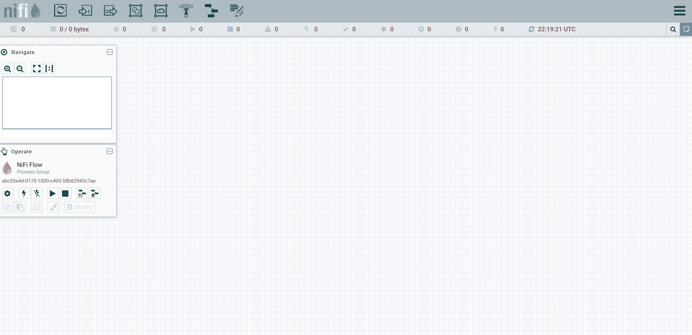
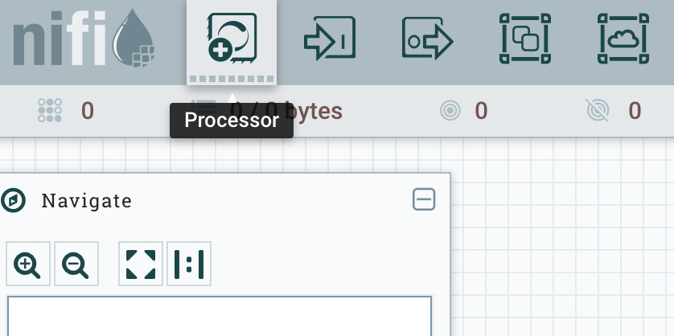
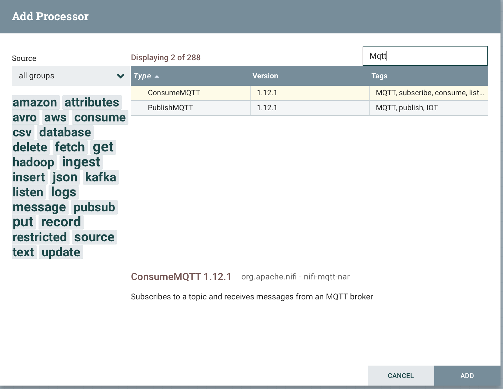
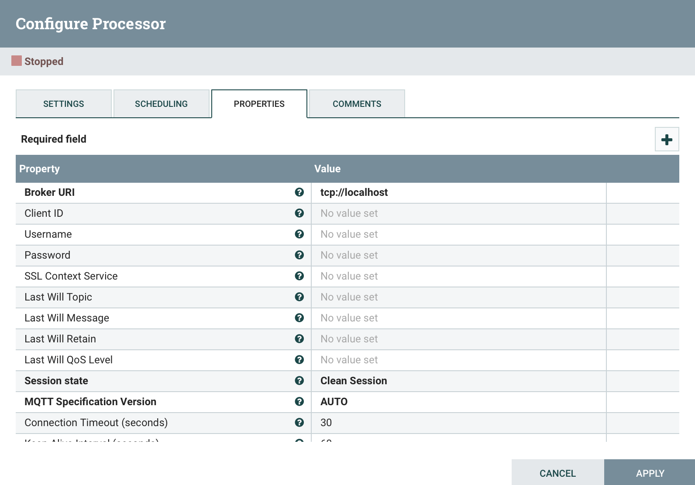
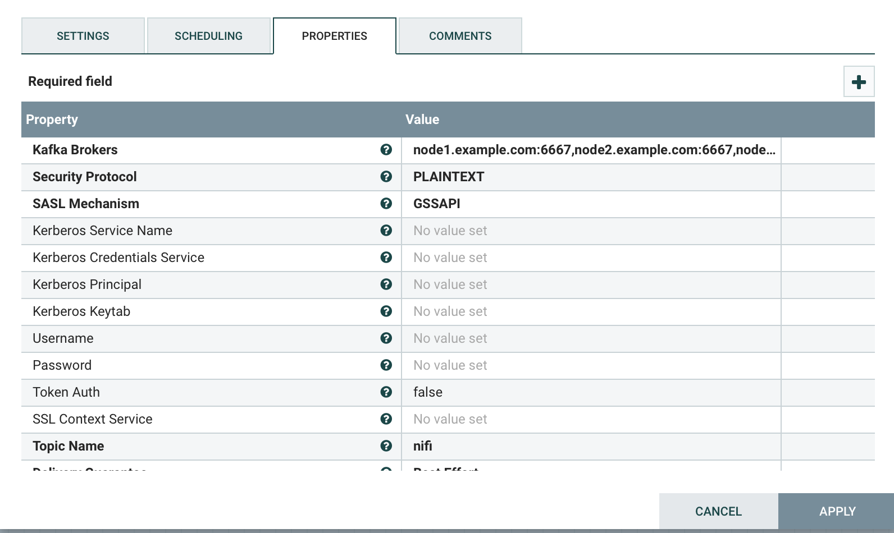
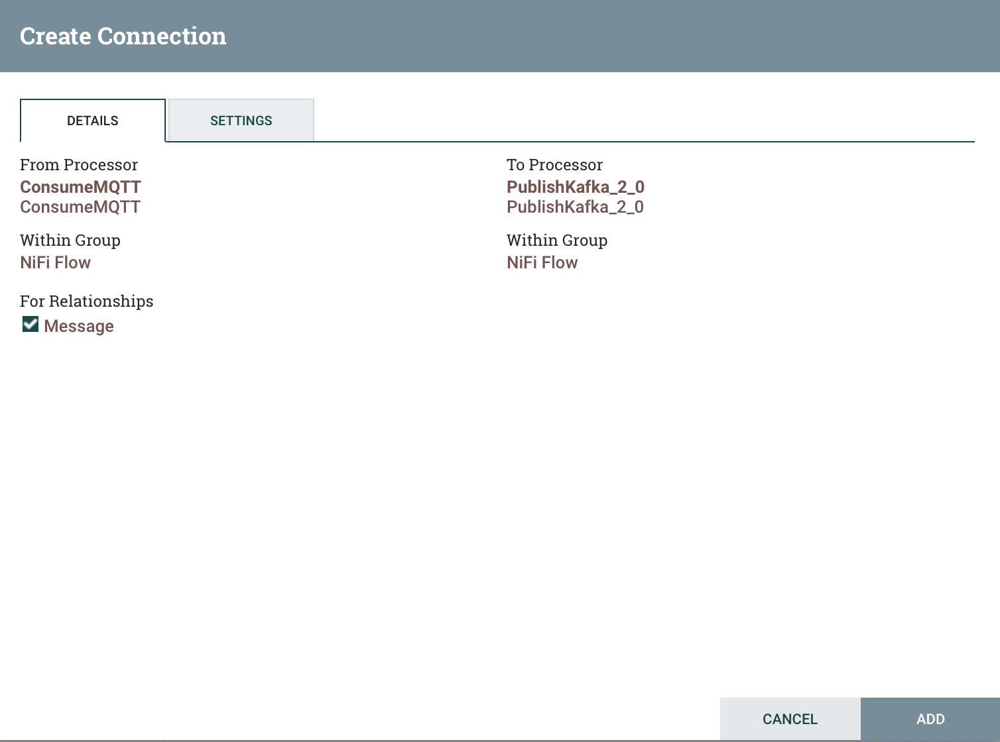
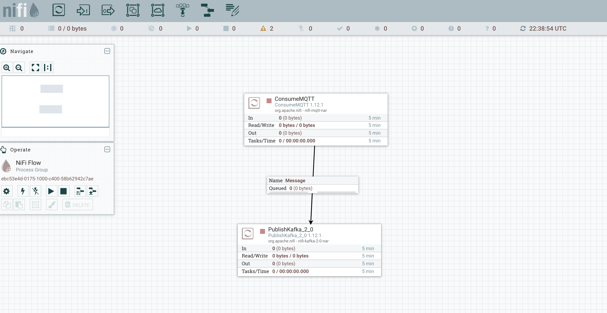
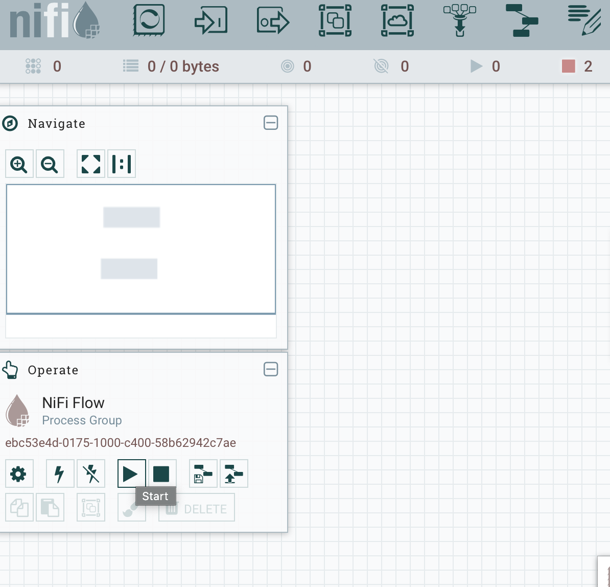
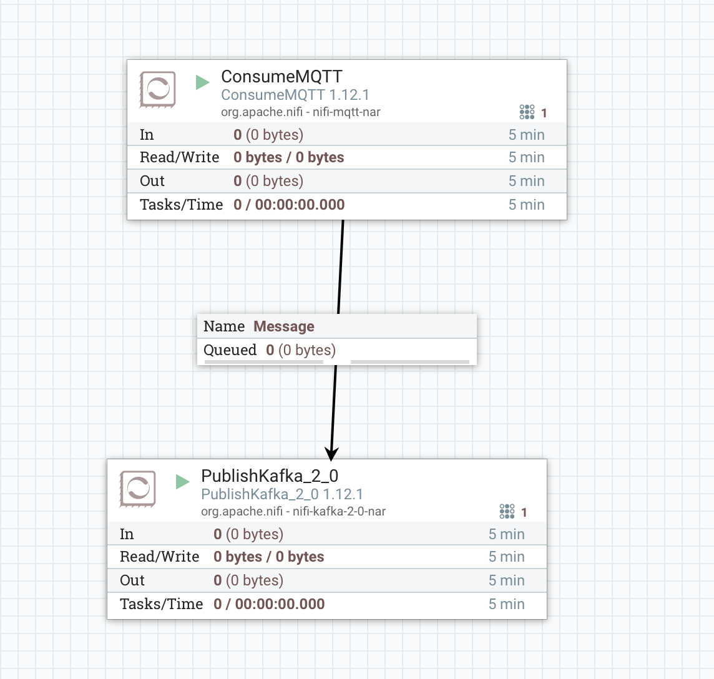

# Apache Nifi MQTT to Kafka

## Prerequisites

- Having provisioned one of the Vagrant 3 nodes cluster or Vagrant single node cluster [instructions here](../02-Provision_the_environment/README.md) 
- Kafka and Zookeeper processes must be started using Ambari 

## Kafka preparation

Connect to node1 

```
$ vagrant ssh node1
```

Create Kafka topic

```console
[vagrant@node1 ~]$ /usr/hdp/3.1.0.0-78/kafka/bin/kafka-topics.sh \
    --create \
    --topic nifi \
    --zookeeper node1.example.com:2181,node2.example.com:2181,node3.example.com:2181 \
    --partitions 1 \
    --replication-factor 1
```

## MQTT preparation

Start the mosquitto service

```console
[vagrant@node1 ~]$ sudo service mosquitto start
```

## Nifi configuration

Start Nifi

```console
[vagrant@hdp-singlenode ~]$ sudo service nifi start
nifi.sh: JAVA_HOME not set; results may vary

Java home: 
NiFi home: /opt/nifi-1.12.1

Bootstrap Config File: /opt/nifi-1.12.1/conf/bootstrap.conf
```

Open you browser to [http://localhost:8090/nifi/](http://localhost:8090/nifi/) (port 8090 on localhost should be redirected to port 8090 on node1 VM).



Add a **ConsumeMQTT** processor





Double click on it and fill the following properties:

- Broker URI: tcp://localhost
- Topic Filter: test
- Quality of Service: 0 - At most once



Add a **PublishKafka_2_0** processor




Double click on it and fill the following properties:

- Kafka Brokers: localhost:6667
- Topic Name: nifi
- Delivery Guarantee: Best Effort

Then, wire the two together by tragging the arrow from ConsumerMQTT to PublishKafka_2_0, a new configuration windows opens: just click on Add.



You should now see a flow as the following:



Start the flow by clicking on the start button



The flow has started




## Publishing to MQTT

Publish a MQTT message 

```
[vagrant@node1 ~]$ mosquitto_pub -h localhost -t test -m "test 123"
```


## Consume from Kafka

Start consuming Kafka messages

```
[vagrant@node1 ~]$ /usr/hdp/3.1.0.0-78/kafka/bin/kafka-console-consumer.sh \
    --topic nifi \
    --from-beginning \
    --bootstrap-server node1.example.com:6667
test 123
```

You should have received the message "test 123" to Kafka routed by NiFi. 