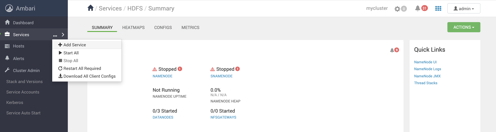
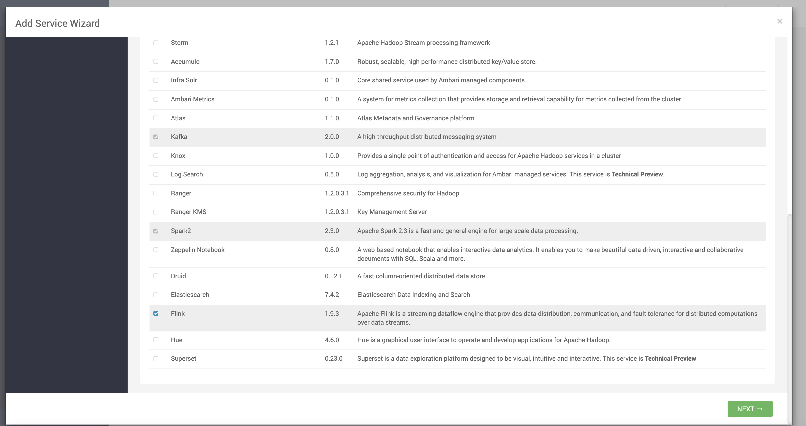
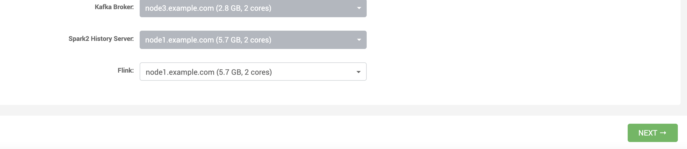
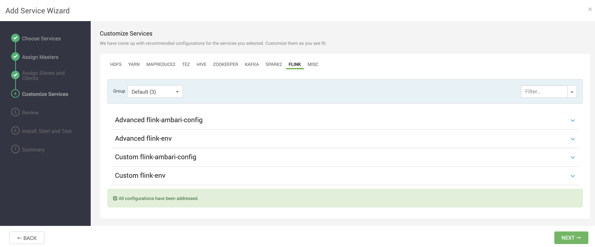
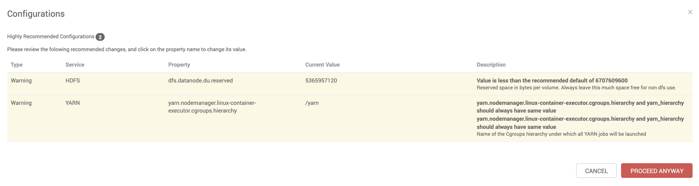
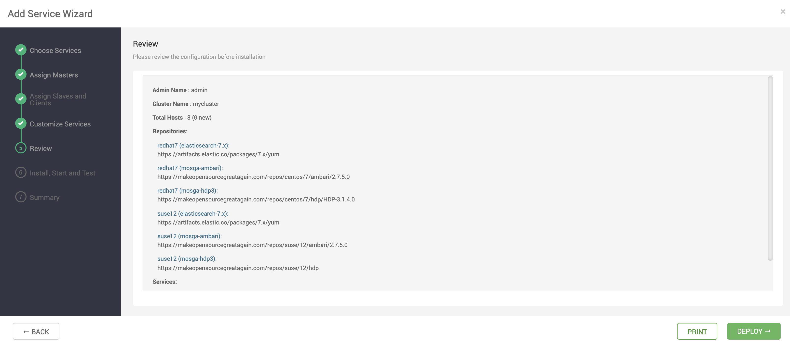

# Stream processing with Apache Flink

## Prerequisites

- Having provisioned one of the Vagrant 3 nodes cluster or Vagrant single node cluster [instructions here](../02-Provision_the_environment/README.md) 
- Having connected to node1 

```
$ vagrant ssh node1
```

## Flink installation

After having logged in into Ambari using the web UI, follow the visual instructions listed below:

Click on Add Service


Select **Flink** and click Next


Select one node to host Apache Flink then click Next


Accept all the defaults and click Next


Aknowledge the warnings and click Proceed anyway


Click Deploy

